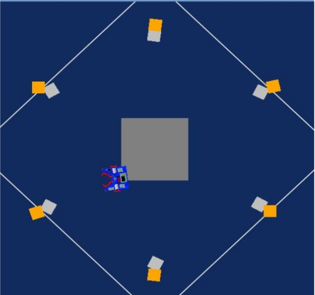
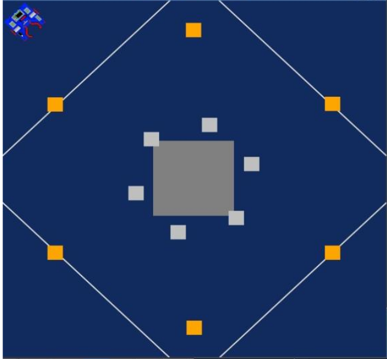
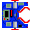
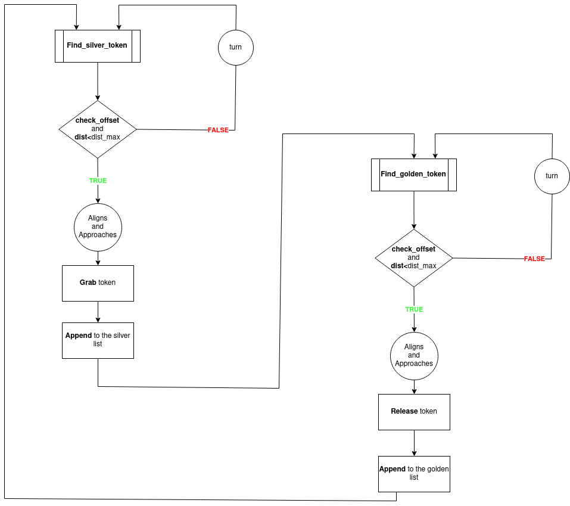

# Research Track: Assignment #1
## Python Robotics Simulator
### Professor [Carmine Recchiuto](https://github.com/CarmineD8)
### Student: [Raffaele Pumpo](https://github.com/RaffaelePumpo)

## Running the code 

The simulator requires a Python 2.7 installation, the [pygame](http://pygame.org/) library, [PyPyBox2D](https://pypi.python.org/pypi/pypybox2d/2.1-r331), and [PyYAML](https://pypi.python.org/pypi/PyYAML/).

Once the dependencies are installed, simply run the `test.py` script to test out the simulator as: `python2 run.py assigment.py` where `assigment.py` contains the code.

## Goal of the assignment
The goal for this assignment is to make a robot that moves silver token close gold token in pairs, as follows:

## Elements in the project
### Arena
The arena contains 6 silver token in the middle and same numbers of golden token around it, as follows:

### Robot
#### Physical structure
The robot is the following:

It has sensors that allows to detect tokens in front of it.

### Code

The  __*main*__    has been implemented in the simplest way, calling, alternatively, only two functions. This choice makes the code more readable and allows a easier test of the functions used.
Thanks to a flowchart can be described the general structure of the code:

#### 
The function implemented *check_offset* allows to check the offset of the token seen by the robot indifferently between silver and golden. It checks if the token is already presents in the lists, in that case the token has been moved before, for the silver ones, or it has already a silver token close it, for the golden ones.
This function has been used as condition in *find_silver_token* and *find_golden_token* before choosing the right token.

### Possible implementations
Since the robot has many distance sensors to be used, it could be also useful to detect, if the robot has already taken a silver token, the others on its way in order to avoid them. 
In the code has not been implemented a system  to stop the robot's task, with the aim is more general possible, in this way the code is efficient when even though the number of tokens changes.
 So an additive feature can be do detect the total number of token present in the arena, and this one used as the ending value for a *FOR* loop instead the while used in the main.

